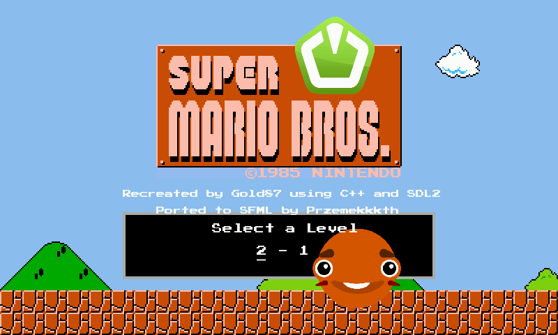

# SFML Super Mario Bros
**SFML Super Mario Bros** is a game that uses the SFML framework to recreate the original, highly popular game [Super Mario Bros](https://en.wikipedia.org/wiki/Super_Mario_Bros.). This project is largely based on Gold87's [repository](https://github.com/Gold872/Super-Mario-Bros) and serves as a port written in Lua language.

## Screenshots

## Controls
| Key    | Action |
| -------- | ------- |
| a, left arrow  | left    |
| d, right arrow | right     |
| space    | jump    |
| s, down arrow    | duck    |
| sprint    | left shift    |
| q    | fireball    |
| escape    | go back    |

## Addons
* [SFML website](https://www.sfml-dev.org)
* [JSON library](https://github.com/nlohmann/json)
